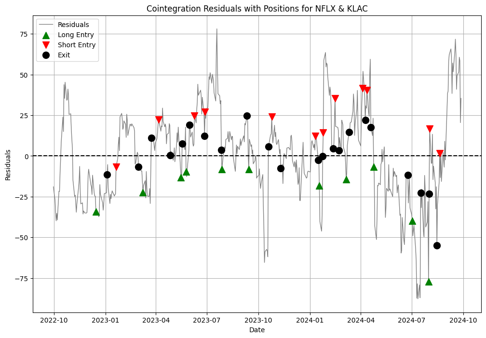

# Cointegration-Based Statistical Arbitrage Strategy

## Project Goals
This project implements a cointegration-based statistical arbitrage trading strategy using stock pairs from the S&P 500 index. The key objectives are to:
- Identify cointegrated stock pairs with stationarity using the Augmented Dickey-Fuller (ADF) test.
- Calculate the half-life of mean reversion for the residuals between cointegrated pairs.
- Backtest a pairs trading strategy based on z-score signals of the residuals.
- Evaluate the performance using metrics like Sharpe ratio and total returns.

## Technologies Used
- **Programming Languages**: Python
- **Libraries**: 
  - `pandas` for data manipulation.
  - `yfinance` for fetching historical stock data.
  - `matplotlib` for plotting stock prices and residuals.
  - `statsmodels` for cointegration and ADF tests.
  - `sklearn` for machine learning models (used for future extensions).
  - `numpy` for numerical operations.

## Relevant Code
### 1. ADF test for stationarity
```python
def adf_test(series):         
    result = adfuller(series)
    return result[1]
```

### 2. Half-life function
```python
def calculate_half_life(residuals):
    residuals_lag = residuals.shift(1).dropna()
    delta_residuals = (residuals - residuals_lag).dropna()
    
    regression = OLS(delta_residuals, residuals_lag).fit()
    half_life = -np.log(2) / regression.params[0]
    
    return half_life
```

### 2. Cointegration test
```python
def cointegration_test(data, start_dates):
    pairs = []
    results = []
    residuals_dict = {}

    tickers = data.columns
    for i in range(len(tickers)):
        for j in range(i + 1, len(tickers)):
            if tickers[i][:3] == tickers[j][:3]:
                continue 

            x = data[tickers[i]].dropna()
            y = data[tickers[j]].dropna()

            x, y = x.align(y, join='inner')

            if start_dates[tickers[i]] != start_dates[tickers[j]]:
                continue 

            if len(x) != len(y) or x.empty or y.empty:
                continue

            try:
                score, p_value, _ = coint(x, y)
            except ValueError:
                continue

            if p_value < 0.05:
                ratio = x / y
                adf_p_value = adf_test(ratio)

                if adf_p_value < 0.05:

                    ols_result = OLS(x, y).fit()
                    residuals = ols_result.resid


                    half_life = calculate_half_life(residuals)

                    pairs.append((tickers[i], tickers[j]))
                    results.append((tickers[i], tickers[j], score, p_value, adf_p_value, half_life))
                    residuals_dict[(tickers[i], tickers[j])] = residuals

    results_df = pd.DataFrame(results, columns=['Stock 1', 'Stock 2', 'Cointegration Score', 'Cointegration p-value', 'ADF p-value', 'Half-life'])
    return results_df, residuals_dict
```

### 3. Backtesting
```python
def backtest_zscore_strategy(stock1_prices, stock2_prices, zscore_residuals):
    positions = []
    returns = []

    position = None
    entry_stock1_price = None
    entry_stock2_price = None

    for i in range(len(zscore_residuals)):
        if position == 'long' and zscore_residuals.iloc[i] >= 0:
            exit_stock1_price = stock1_prices.iloc[i]
            exit_stock2_price = stock2_prices.iloc[i]

            long_return = (exit_stock1_price - entry_stock1_price) / entry_stock1_price
            short_return = (entry_stock2_price - exit_stock2_price) / entry_stock2_price
            returns.append(long_return + short_return)
            positions.append(('exit', i))

            position = None
            continue

        elif position == 'short' and zscore_residuals.iloc[i] <= 0:
            exit_stock1_price = stock1_prices.iloc[i]
            exit_stock2_price = stock2_prices.iloc[i]

            long_return = (exit_stock2_price - entry_stock2_price) / entry_stock2_price
            short_return = (entry_stock1_price - exit_stock1_price) / entry_stock1_price
            returns.append(long_return + short_return)
            positions.append(('exit', i))

            position = None
            continue

        if position is None and zscore_residuals.iloc[i] <= -1.:
            entry_stock1_price = stock1_prices.iloc[i]
            entry_stock2_price = stock2_prices.iloc[i]
            position = 'long'
            positions.append(('long', i))

        elif position is None and zscore_residuals.iloc[i] >= 1:
            entry_stock1_price = stock1_prices.iloc[i]
            entry_stock2_price = stock2_prices.iloc[i]
            position = 'short'
            positions.append(('short', i))

    return positions, returns
```

## Trades





## Results
### Total Return Over 2 Years: 16.5%
### Sharpe Ratio: 1.21